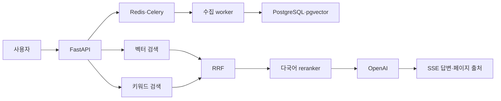

# 사내 문서 AI 검색·질의응답 시스템

한국어 PDF를 업로드하면 페이지 정보를 보존해 청킹·임베딩하고, 벡터 검색과 키워드 검색을 결합한 뒤 reranker로 근거를 정제해 출처와 함께 답변하는 RAG 백엔드입니다.

## 해결하려는 문제

- 표현이 달라 키워드만으로 찾기 어려운 사내 규정을 의미 기반으로 검색한다.
- 제도명·약어·숫자처럼 정확한 문자열 신호도 함께 반영한다.
- 답변과 원본 PDF 페이지를 연결해 사용자가 근거를 다시 확인할 수 있게 한다.
- 긴 PDF 처리, 외부 API 실패, 중복 업로드를 요청 경로에서 분리한다.
- 외부 서비스 없이 반복 가능한 테스트와 인프라 정적 검증을 제공한다.

## 핵심 흐름

```text
PDF 업로드 → Celery 비동기 수집 → 토큰 청킹 → OpenAI 임베딩
→ PostgreSQL/pgvector + pg_trgm → RRF → 다국어 reranker
→ OpenAI 답변 → SSE 스트리밍 + 페이지 출처
```



## 주요 기술 판단

| 판단 | 선택 | 이유 |
|---|---|---|
| 서비스 구조 | 모듈형 모놀리스 + 별도 worker | 로컬 재현성을 유지하면서 API와 긴 수집 작업 분리 |
| 검색 | pgvector + pg_trgm + RRF | 의미 검색과 정확한 용어 신호를 점수 척도와 무관하게 결합 |
| 재정렬 | `bge-reranker-v2-m3` | 한국어를 포함한 다국어 질문·청크 관련도 보정 |
| 출처 | 검색 메타데이터로 별도 구성 | LLM이 파일명·페이지를 만들어내지 못하도록 신뢰 경계 분리 |
| 캐시 | 문서 세대가 포함된 Redis 키 | 문서 추가·삭제 시 전체 키 스캔 없이 무효화 |
| 관측성 | 선택적 Langfuse + no-op fallback | 추적 장애가 사용자 답변을 실패시키지 않게 격리 |
| 배포 | Docker Compose 실행 + Terraform 검증 | 상시 AWS 비용 없이 재현과 운영 설계 증빙 |

## 로컬 실행

필요한 도구는 Docker Desktop과 OpenAI API 키입니다. AWS나 Langfuse 계정은 없어도 됩니다.

```powershell
Copy-Item .env.example .env
# .env의 OPENAI_API_KEY를 실제 키로 교체
docker compose up --build
```

첫 질의에서 reranker 모델을 내려받기 때문에 응답이 평소보다 늦을 수 있습니다. API 문서는 `http://localhost:8000/docs`, 준비 상태는 `http://localhost:8000/health/ready`에서 확인합니다.

### PDF 업로드

```powershell
curl.exe -X POST http://localhost:8000/api/v1/documents `
  -F "file=@C:\docs\휴가규정.pdf;type=application/pdf"
```

응답의 `id`로 처리 상태를 확인합니다.

```powershell
curl.exe http://localhost:8000/api/v1/documents/{문서-ID}
```

### 일반 질의

```powershell
curl.exe -X POST http://localhost:8000/api/v1/query `
  -H "Content-Type: application/json" `
  -d '{"question":"연차 휴가는 며칠인가요?"}'
```

### SSE 스트리밍 질의

```powershell
curl.exe -N -X POST http://localhost:8000/api/v1/query/stream `
  -H "Content-Type: application/json" `
  -d '{"question":"재택근무 신청 절차를 알려주세요."}'
```

이벤트 순서는 `metadata → token 반복 → sources → done`이며 오류 시 `error`를 반환합니다.

## 검색 품질 평가

예제 결과로 평가 도구를 확인할 수 있습니다.

```powershell
python -m evaluation.run --results evaluation/retrieval-results.example.jsonl
```

실제 실험에서는 동일한 질문 세트로 벡터 단독, 하이브리드, reranker 결과를 각각 저장해 Recall@5, MRR, nDCG@5를 비교합니다.

## API

| 메서드 | 경로 | 설명 |
|---|---|---|
| `POST` | `/api/v1/documents` | PDF 등록 후 `202` 반환 |
| `GET` | `/api/v1/documents` | 문서 목록 |
| `GET` | `/api/v1/documents/{id}` | 수집 상태·오류 조회 |
| `DELETE` | `/api/v1/documents/{id}` | 원본·청크 삭제 |
| `POST` | `/api/v1/query` | 일반 질의응답 |
| `POST` | `/api/v1/query/stream` | SSE 스트리밍 질의응답 |
| `GET` | `/health/live` | 프로세스 생존 상태 |
| `GET` | `/health/ready` | PostgreSQL·Redis 준비 상태 |

## 테스트와 정적 검증

기본 테스트는 OpenAI·Langfuse·AWS에 접속하지 않습니다.

```powershell
.venv\Scripts\python -m pytest -q
.venv\Scripts\python -m ruff check .
.venv\Scripts\python -m mypy src
$env:OPENAI_API_KEY='test-key'; docker compose config -q
terraform -chdir=infra/terraform fmt -check -recursive
terraform -chdir=infra/terraform validate
```

`TEST_DATABASE_URL`을 설정하면 실제 PostgreSQL의 `vector` 확장 통합 테스트도 실행합니다.

## 프로젝트 구조

```text
src/company_doc_rag/
├─ api/              HTTP·SSE 계약
├─ application/      수집·검색·답변 유스케이스
├─ domain/           프레임워크 독립 모델·포트
├─ infrastructure/   DB·OpenAI·Redis·파일·Langfuse 어댑터
└─ workers/          Celery 작업·재시도
evaluation/          검색 평가 데이터·지표
infra/terraform/     AWS 참고 아키텍처
docs/                설계·운영·콘텐츠 원고
```

## Langfuse

`.env`에 `LANGFUSE_PUBLIC_KEY`, `LANGFUSE_SECRET_KEY`, `LANGFUSE_HOST`를 모두 설정하면 추적이 활성화됩니다. 질문과 문서 원문 대신 질문 해시, 후보 수, 결과 수 같은 메타데이터만 기본 기록하며 Langfuse 장애는 답변 실패로 전파하지 않습니다.

## 종료

```powershell
docker compose down
```

로컬 문서와 DB 데이터를 함께 지우려면 `docker compose down -v`를 사용합니다. 이 명령은 복구할 수 없는 로컬 데이터 삭제이므로 필요한 문서를 먼저 백업하세요.

## 설계 문서

- [시스템 설계](docs/superpowers/specs/2026-08-12-company-doc-rag-design.md)
- [구현 계획](docs/superpowers/plans/2026-08-12-company-doc-rag-implementation.md)
- [로컬 아키텍처](docs/architecture/local.md)
- [AWS 참고 아키텍처](docs/architecture/aws.md)

## 기술 블로그·LinkedIn 콘텐츠

- [1편: 사내 문서 RAG를 모듈형 백엔드로 설계한 이유](docs/content/01-project-overview.md)
- [2편: 벡터 검색에 RRF와 reranker를 추가한 이유](docs/content/02-hybrid-search.md)
- [3편: 로컬 RAG를 운영 환경으로 매핑하기](docs/content/03-operations-and-aws.md)
- [LinkedIn 게시물 초안과 연결 방법](docs/content/linkedin-post.md)
- [검색 품질 벤치마크 기록 방법](docs/content/benchmark-template.md)

게시 후 실제 URL을 이 섹션에 추가하고, 외부 글에서는 관련 구현 커밋과 재현 명령으로 다시 연결합니다.
