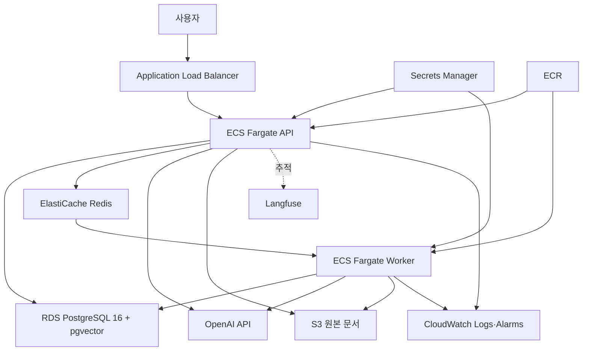

# AWS 참고 아키텍처

이 문서는 로컬 Docker Compose 구성을 운영 환경으로 확장할 때의 AWS 토폴로지와 Terraform 검증 방법을 설명한다. 현재 포트폴리오에서는 실제 `terraform apply`를 수행하지 않는다.

## 구성



- ALB만 공용 서브넷에 배치한다.
- API와 worker는 사설 애플리케이션 서브넷에서 실행한다.
- RDS와 ElastiCache는 인터넷 경로가 없는 데이터 서브넷에 둔다.
- 보안 그룹은 `ALB → API:8000`, `API·worker → PostgreSQL:5432/Redis:6379`만 허용한다.
- 외부 OpenAI·Langfuse와 ECR 접근을 위해 NAT Gateway를 사용한다.
- RDS와 Redis의 저장 암호화, S3 public access block과 버전 관리를 활성화한다.

## 로컬 구성 대응

| 로컬 | AWS |
|---|---|
| FastAPI 컨테이너 | ECS Fargate API + ALB |
| Celery worker | ECS Fargate worker |
| PostgreSQL/pgvector | RDS PostgreSQL 16 |
| Redis | ElastiCache Redis |
| 로컬 업로드 볼륨 | S3 문서 버킷 |
| `.env` | Secrets Manager + ECS 환경변수 |
| 컨테이너 이미지 | ECR |
| 로컬 로그 | CloudWatch Logs·Alarms |

현재 애플리케이션 기본 파일 어댑터는 로컬 볼륨을 사용한다. 실제 AWS 배포 전에 `LocalFileStorage` 포트를 S3 구현으로 교체해야 하며, Terraform의 S3 권한과 `S3_BUCKET_NAME`은 그 운영 구현을 위한 경계를 보여준다. 이 저장소의 Terraform은 인프라 설계 검증 범위이며 애플리케이션을 실제 배포하지 않는다.

## 정적 검증

다음 명령은 공급자 플러그인을 내려받고 구성을 검사하지만 AWS 리소스를 생성하지 않는다.

```powershell
terraform -chdir=infra/terraform fmt -check -recursive
terraform -chdir=infra/terraform init -backend=false
terraform -chdir=infra/terraform validate
```

## 실제 적용 전 필요한 작업

1. 별도의 state 버킷과 잠금 테이블을 만든 뒤 `backend.tf.example`을 복사하고 값을 교체한다.
2. 이미지를 ECR에 push하고 불변 태그가 포함된 URI를 `container_image`에 설정한다.
3. `allowed_cidr_blocks`를 실제 접근 IP로 제한한다.
4. Secrets Manager의 OpenAI API 키, DB URL, 선택적 Langfuse 키에 값을 등록한다.
5. RDS 마이그레이션에서 `vector`, `pg_trgm` 확장 생성 권한을 확인한다.
6. S3 파일 저장 어댑터를 구현하고 수집 작업의 임시 파일 정리 정책을 검증한다.
7. HTTPS용 ACM 인증서와 443 리스너, WAF, Route 53을 운영 요구에 맞게 추가한다.

## 비용 주의

NAT Gateway, ALB, ECS Fargate, RDS, ElastiCache는 트래픽이 없어도 비용이 발생할 수 있다. 이 포트폴리오에서는 `plan`이나 `apply`를 실행하지 않으며, 정적 검증 이후 생성된 `.terraform` 디렉터리만 로컬에 남는다.

