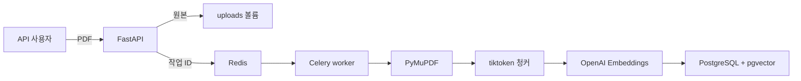
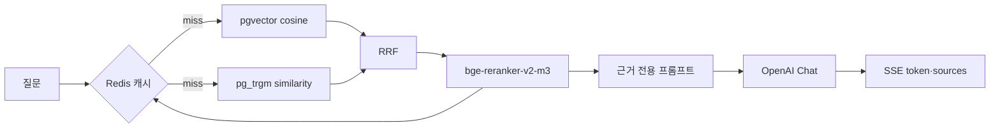

# 로컬 아키텍처

## 요청과 수집 경로

업로드 API는 파일 시그니처, MIME 유형, 확장자, 크기, SHA-256 중복을 검증한다. 원본 저장과 문서 레코드 생성이 끝나면 Celery에 문서 ID만 전달하고 `202 Accepted`를 반환한다. 작업자는 문서 상태를 `PENDING → PROCESSING → READY`로 바꾸며 도메인 오류는 구분된 코드와 함께 `FAILED`에 저장한다.

## 질의응답 경로

벡터와 키워드 검색은 점수 범위가 다르므로 원점수를 직접 더하지 않고 순위 기반 RRF로 결합한다. 상위 12개만 cross-encoder에 전달해 비용과 지연을 제한하고 최종 5개 근거를 답변에 사용한다. 출처는 LLM 출력에서 추출하지 않고 검색 결과의 문서 ID·파일명·페이지로 구성한다.

## 모듈 경계

| 모듈 | 책임 | 외부 의존성 |
|---|---|---|
| `domain` | 문서·검색·답변 모델, 오류, 포트 | 없음 |
| `application` | 수집·검색·답변·문서 유스케이스 | 도메인 포트 |
| `api` | HTTP 검증, 오류 응답, SSE 형식 | FastAPI |
| `infrastructure` | DB, OpenAI, Redis, 파일, reranker, Langfuse | 공급자 SDK |
| `workers` | Celery 작업과 재시도 정책 | Redis/Celery |
| `evaluation` | Recall@K, MRR, nDCG@K | JSONL 결과 |

도메인과 애플리케이션 테스트는 외부 네트워크를 호출하지 않는다. PostgreSQL 확장 검증은 `TEST_DATABASE_URL`이 있을 때만 실행하며 OpenAI 호출이 필요한 검증은 별도 외부 테스트로 분리한다.

## 장애 처리

- OpenAI transient 오류는 제한된 지수 백오프 후 `TRANSIENT_EMBEDDING_ERROR`로 변환한다.
- Celery는 transient 임베딩 오류만 최대 3회 재시도한다.
- Langfuse SDK 오류는 no-op span으로 대체해 답변 경로로 전파하지 않는다.
- 문서 생성·삭제 시 실패한 파일 저장은 보상 삭제한다.
- 문서 세대를 Redis 키에 포함해 추가·삭제 후 이전 검색 캐시가 사용되지 않게 한다.

