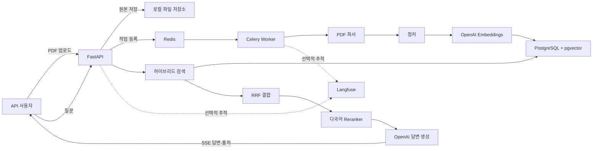

# 사내 문서 AI 검색·질의응답 시스템 설계

## 1. 목표

한국어 사내 문서를 업로드하고 자연어로 질문하면 관련 근거를 검색해 출처와 함께 답하는 RAG 시스템을 만든다. 프로젝트는 AI/RAG 백엔드 엔지니어 포트폴리오를 목적으로 하며, 로컬에서 재현 가능한 실행 환경과 운영 환경을 가정한 AWS Terraform 구성을 함께 제공한다.

### 성공 기준

- `docker compose up`으로 API, 작업자, PostgreSQL/pgvector, Redis를 실행할 수 있다.
- 한국어 PDF 업로드부터 파싱, 청킹, 임베딩, 저장까지 비동기로 처리한다.
- 벡터 검색과 키워드 검색을 결합하고 reranker로 최종 근거 순서를 보정한다.
- 답변은 SSE로 스트리밍하며 문서명, 페이지, 인용 구간을 출처로 반환한다.
- OpenAI API 키와 모델명은 환경변수로 관리하며 비밀값은 커밋하지 않는다.
- Langfuse 연동은 선택 사항으로 두고 설정하지 않아도 시스템이 동작한다.
- 단위·통합 테스트와 검색 품질 평가 결과를 포트폴리오 근거로 남긴다.
- AWS에 실제 배포하지 않아도 아키텍처와 Terraform 구성을 검증할 수 있다.

## 2. 범위

### 1차 구현

- 한국어 텍스트 PDF
- 문서 등록, 상태 조회, 목록 조회, 삭제
- 비동기 수집 파이프라인
- 토큰 기반 청킹과 페이지 메타데이터 보존
- OpenAI 임베딩 및 답변 생성
- PostgreSQL `vector`와 `pg_trgm` 기반 하이브리드 검색
- Reciprocal Rank Fusion(RRF)
- 다국어 cross-encoder reranker
- 근거 기반 프롬프트와 출처 표시
- FastAPI, SSE 스트리밍, Redis 캐시 및 작업 큐
- Docker Compose 로컬 환경
- 선택적 Langfuse 추적
- AWS 아키텍처 문서와 Terraform

### 후속 확장

- DOCX, TXT, Markdown 로더
- OCR이 필요한 스캔 PDF
- 사용자·조직 인증과 문서 접근 제어
- 대화 이력과 멀티턴 질의 재작성
- 실제 AWS 배포와 CI/CD

### 제외 범위

- 상시 공개 데모
- 실제 사내 기밀 문서
- 프런트엔드 애플리케이션
- 과거 날짜를 조작한 커밋 기록

## 3. 접근 방식 비교

### A. 동기식 FastAPI 단일 프로세스

구현은 가장 단순하지만 큰 PDF 처리 중 API가 오래 점유되고, Redis와 비동기 작업 능력을 보여주기 어렵다.

### B. 모듈형 모놀리스와 별도 작업자 — 채택

하나의 Python 패키지 안에서 API, 도메인, 검색, 인프라 어댑터를 분리하고 Celery 작업자가 수집을 처리한다. 로컬 실행은 단순하면서도 비동기 처리, 재시도, 관측성, 테스트 가능한 경계를 보여줄 수 있다.

### C. 마이크로서비스 분리

수집, 검색, 생성 서비스를 각각 배포할 수 있지만 로컬 운영 복잡도와 코드량이 포트폴리오 핵심인 RAG 품질보다 커진다. 현재 범위에는 적용하지 않는다.

## 4. 논리 아키텍처

## 5. 모듈 경계

- `api`: HTTP 요청 검증, 상태 코드, SSE 이벤트 형식만 담당한다.
- `application`: 문서 수집과 질의응답 유스케이스를 조정한다.
- `domain`: 문서, 청크, 검색 결과, 출처 모델과 포트 인터페이스를 정의한다.
- `infrastructure`: PostgreSQL, OpenAI, Redis, 파일 저장소, Langfuse 구현을 제공한다.
- `workers`: Celery 작업 진입점과 재시도 정책을 관리한다.
- `evaluation`: 고정 질의·정답 데이터로 검색 및 답변 품질을 측정한다.

도메인과 애플리케이션 계층은 FastAPI, SQLAlchemy, OpenAI SDK의 구체 타입을 직접 의존하지 않는다. 테스트에서는 외부 서비스를 가짜 구현으로 교체한다.

## 6. 데이터 흐름

### 문서 수집

1. API가 파일 확장자, MIME 유형, 크기, 중복 해시를 검증한다.
2. 원본을 저장하고 문서 상태를 `PENDING`으로 생성한다.
3. Redis 큐에 문서 ID를 전달하고 즉시 `202 Accepted`를 반환한다.
4. 작업자가 PDF 페이지별 텍스트를 추출하고 빈 문서를 거부한다.
5. 페이지 경계를 보존하며 토큰 기준으로 겹치는 청크를 만든다.
6. 임베딩을 배치 생성해 청크와 함께 저장한다.
7. 성공 시 `READY`, 실패 시 오류 코드와 함께 `FAILED`로 변경한다.

### 질의응답

1. 질문을 임베딩하고 벡터 후보와 trigram 키워드 후보를 각각 조회한다.
2. 두 순위를 RRF로 결합한다.
3. 상위 후보를 다국어 cross-encoder로 재정렬한다.
4. 점수 기준을 통과한 근거만 번호가 있는 컨텍스트로 구성한다.
5. LLM에는 근거 밖의 내용을 추측하지 말고 근거가 없으면 모른다고 답하도록 지시한다.
6. SSE로 메타데이터, 답변 토큰, 출처, 완료 또는 오류 이벤트를 전송한다.

## 7. 저장 모델

- `documents`: ID, 파일명, SHA-256, MIME 유형, 저장 경로, 상태, 오류 정보, 생성·수정 시각
- `chunks`: ID, 문서 ID, 순번, 페이지 시작·끝, 본문, 토큰 수, 임베딩
- 인덱스: 문서 ID, 상태, 벡터 HNSW, 본문 trigram GIN

원본 PDF와 추출 텍스트는 DB에 중복 저장하지 않는다. 청크에는 출처 표시에 필요한 최소 메타데이터만 둔다.

## 8. API 초안

- `POST /api/v1/documents`: PDF 업로드, `202 Accepted`
- `GET /api/v1/documents`: 문서 목록
- `GET /api/v1/documents/{id}`: 처리 상태와 오류 정보
- `DELETE /api/v1/documents/{id}`: 원본·청크 삭제
- `POST /api/v1/query`: 비스트리밍 질의응답
- `POST /api/v1/query/stream`: SSE 스트리밍 질의응답
- `GET /health/live`: 프로세스 생존 확인
- `GET /health/ready`: DB와 Redis 준비 상태

## 9. 오류 처리와 안전장치

- 허용되지 않은 파일, 용량 초과, 빈 PDF, 암호화 PDF를 구분된 오류 코드로 반환한다.
- 문서 해시로 중복 업로드를 방지한다.
- OpenAI 호출은 지수 백오프와 제한된 재시도를 적용한다.
- Celery 작업은 동일 문서에 대해 멱등성을 보장한다.
- 질문, 파일명, 문서 본문을 기본 로그에 그대로 남기지 않는다.
- 업로드 경로는 서버가 생성하며 사용자 파일명을 경로로 사용하지 않는다.
- API 키, Langfuse 키, AWS 자격 증명은 환경변수 또는 Secrets Manager 참조로만 다룬다.

## 10. 캐시 전략

- 질문 정규화 값, 대상 문서 집합, 검색 설정의 해시를 Redis 캐시 키로 사용한다.
- 검색 결과만 짧게 캐시하고 생성 답변은 기본적으로 캐시하지 않는다.
- 문서 추가·삭제 시 문서 세대 번호를 증가시켜 기존 캐시를 자연스럽게 무효화한다.

## 11. 테스트와 평가

- 단위 테스트: 청킹 경계, RRF, 점수 정규화, 출처 조립, 상태 전이
- API 테스트: 업로드 검증, 상태 조회, 오류 응답, SSE 이벤트 순서
- 저장소 통합 테스트: pgvector 검색, trigram 검색, 삭제 연쇄
- 작업자 테스트: 성공, 재시도, 멱등성, 부분 실패 복구
- 평가: 한국어 샘플 문서와 질의 세트로 Recall@K, MRR, nDCG@K, 출처 정확률 비교
- 성능: 수집 처리량, 검색 p50/p95, 첫 토큰 시간, 전체 응답 시간을 기록

외부 API를 호출하는 테스트는 별도 마커로 분리하고 기본 테스트에서는 가짜 임베더와 가짜 생성기를 사용한다.

## 12. 로컬 실행

기본 Docker Compose 서비스는 `api`, `worker`, `postgres`, `redis`다. 호스트에는 Docker와 OpenAI API 키만 필요하다. Langfuse는 환경변수가 있을 때만 활성화하고, 없어도 no-op 관측 구현으로 동작한다.

## 13. AWS와 Terraform

실제 생성하지 않는 참고용 운영 구조는 다음과 같다.

- ALB → ECS Fargate API
- ECS Fargate 작업자 → ElastiCache Redis 작업 큐
- RDS PostgreSQL + pgvector
- S3 원본 문서 저장
- ECR 컨테이너 이미지
- Secrets Manager 비밀값
- CloudWatch 로그와 경보
- VPC, 공용 ALB 서브넷, 사설 애플리케이션·데이터 서브넷

Terraform은 환경별 변수, 원격 상태 설정 예시, 최소 권한 IAM을 포함한다. `terraform validate`와 정적 검사까지만 자동화하고 `apply`는 수행하지 않는다. 적용할 경우 비용이 발생함을 문서에 명시한다.

## 14. Langfuse 관측성

- 수집 작업과 질의응답을 각각 trace로 기록한다.
- 검색 후보 수, RRF·reranker 점수, 사용 모델, 토큰 수, 지연 시간을 span 메타데이터로 남긴다.
- 문서 본문과 질문은 기본적으로 마스킹하고 명시적 개발 설정에서만 원문 기록을 허용한다.
- Langfuse 장애는 사용자 질의응답 실패로 전파하지 않는다.

## 15. Git 기록 규칙

- 실제 완료된 작업 단위마다 커밋한다.
- 타입은 `feat`, `fix`, `refactor`, `docs`, `test`, `chore`, `perf`, `ci`, `build`를 사용한다.
- 제목은 `feat: PDF 문서 수집 파이프라인 구현`처럼 한글 명령형 요약으로 작성한다.
- 코드 주석, docstring, README, PR 설명은 한글을 기본으로 한다.
- 작성자·시간을 조작하거나 과거 작업처럼 보이게 만들지 않는다.

## 16. LinkedIn·기술 블로그 연결

각 구현 단계에서 다음 근거를 함께 남긴다.

1. 문제 정의와 전체 아키텍처
2. PDF 청킹 전략과 페이지 출처 보존
3. 벡터 검색 대비 하이브리드 검색·reranker 품질 비교
4. SSE 스트리밍과 Redis 비동기 처리
5. Langfuse로 확인한 지연 시간과 토큰 사용량
6. Docker 로컬 재현성과 AWS Terraform 매핑

저장소에는 게시물 원고, Mermaid 구조도, 벤치마크 표, 재현 명령을 보관한다. README에서 기술 블로그 시리즈와 LinkedIn 게시물로 연결하고, 게시물에서는 해당 단계의 커밋 또는 태그로 역링크한다. 자동 게시나 계정 연동은 범위에 포함하지 않는다.

## 17. 구현 단계

1. 프로젝트 기반과 설정
2. 문서 모델·PDF 파싱·청킹
3. PostgreSQL/pgvector 저장과 OpenAI 임베딩
4. 하이브리드 검색·RRF·reranker
5. 근거 기반 답변·출처·SSE
6. Redis·Celery 비동기 수집과 캐시
7. Langfuse 관측성과 평가
8. Docker Compose와 운영 문서
9. AWS 아키텍처와 Terraform
10. LinkedIn·기술 블로그용 포트폴리오 자료
